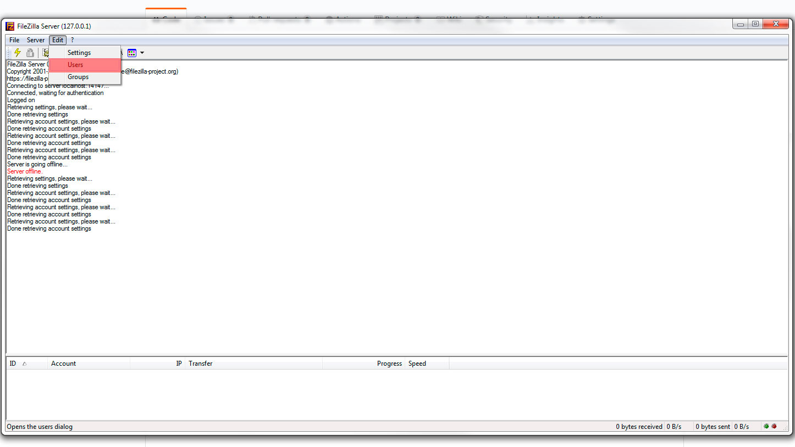
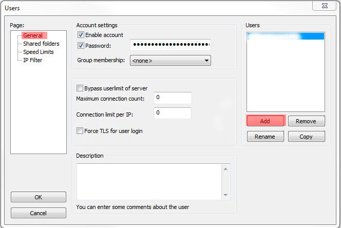
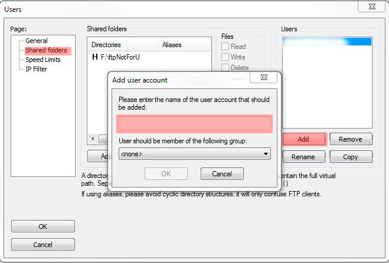
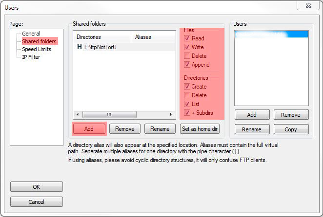
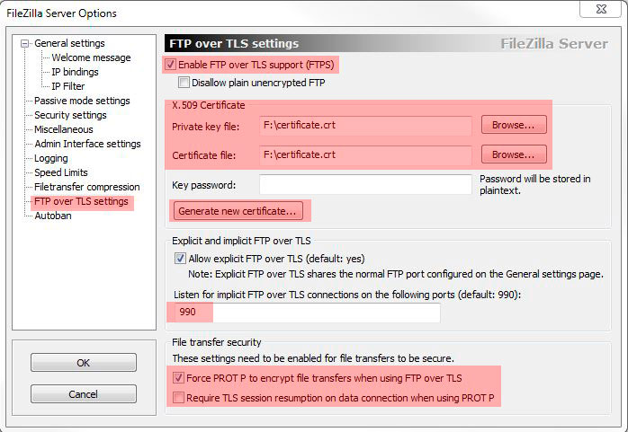
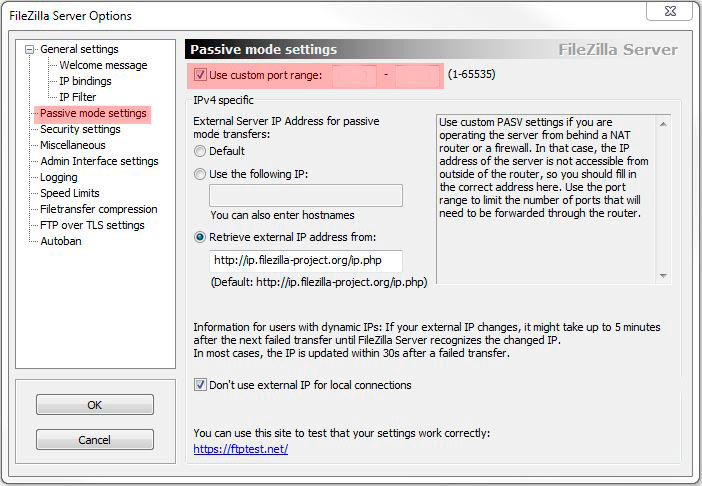

# FileZilla configurations
In order to ensure proper workflow make the following configurations:
* Edit FTP users **Edit->Users**:

* Add new user, dont forget a password **Edit->Users->General->Add**:

* Add a folder which you'll share: **Edit->Users->Shared Folders->Add**: 
Add a user which can access this folder:

 After choosing a folder, configure user access rights like on screenshot:
 
* Configure FTP over TLS **Edit->Settings->FTP over TLS settings**:
 
		
		1. Generate new certificate and choose it.
		2. Enable FTP over TLS.
		3. Allow explicit FTP over TLS.
		4. Choose a port you want to use.
		5. Check Force PROT P to encrypt file transfers when using FTP over TLS.
		6. Uncheck Require TLS session resumption on data connection when using PROT P.
* Configure Passive mode settings **Edit->Settings->Passive mode settings**:
 
Check **Use custom port range** and choose desired ports for passive mode.
		
