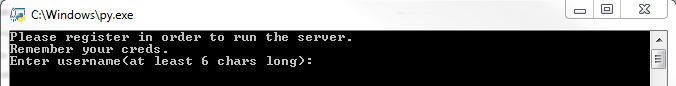

# Simple-RAT
**A simple Remote Acces Trojan written in Python.**

Simple Remote Access Trojan I wrote in college to show the principles of such program.
It consists of client and server sides. Besides serving as a C&C, server side provides a web application to interact with infected computers.<br>
**Written for Windows OS & tested only on Win7**. It is not perfect and has some problems, you can experiment with it and change it in any way you want.<br>
Available interactions are browsing and downloading files, browsing through keylogs, and screenshots of user's screen.

# Getting Started
**It's easy to get it running! Just follow these simple steps.**
#### Installing Prerequisites
1. **Installing and configuring FileZilla<br>**
To get it running on your system, you will have to install and configure a FTP server.<br>
I used the [**FileZilla Server**](https://filezilla-project.org/) and recommend it for usage.<br>
You will need this because file upload implemented with FTP protocol.<br>
Make sure to configure FileZilla Server in the following way: [FileZilla Config](FileZilla-Config.md).<br>
1. **Installing required packages**<br>
In order to make it work, install the modules listed in **requirements.txt** with **pip**:<br>
    ```python
    pip install  -r <path to requirements.txt>
    ```
  
1. **Installing PyInstaller**<br>
This step is not mandatory, but if you'll want to compile the programm to a single executable, <br>
I recommend using **PyInstaller**:
    ```python
    pip install PyInstaller
    ```
    or a GUI version called **Auto PY to EXE**:
    ```python
    pip install auto-py-to-exe
    ```

#### Configuring
**After installing all prerequisites and configuring your ftp client, you should configure the client and the server side of the app.**<br>
1. **Configuring the server.**<br>
Open **server\RAT_server.py** with your editor and edit the following lines(lines no. 23-24).<br>
Change HOST and PORT to your address(on this address the server will await incoming connections).
    ```python
    23. HOST = ''
    24. PORT = 0
    ```
    Then go to the last line, and change the host and port to ones you want to(on this address the web application for interaction with clients will be served).<br>
    The default option is to listen on all adresses and port **443**.
    ```python
    287. https_server = WSGIServer(('0.0.0.0',443), app)
    ```
1. **Configuring the client.**<br>
   Open **client\ftp_uploader.py** with your editor and edit the following lines(lines no. 6-8).
   Change **host** to address of your FTP server, **user** and **pswd** to the ones you've configured on your FTP server.
   ```python
   6. host = # ftp address
   7. user = # username
   8. pswd = # password
   ```
   Open **client\rat.py** with your editor and edit the following lines(39-40).<br>
   Change **HOST** and **PORT** to the address of your server, which you configured in step 1.(On this address the client - infected comp. will make a connection to the server) 
   ```python
   39. HOST = ''
   40. PORT = 65432
   ```

#### Running
**Running the server.**
1. Run **server\RAT_server.py** The app will prompt you to register, you will need this in order to access it from the browser.<br>
   <br>
   After entering your credentials(remember them), you will be notified that the app is running.
1. Access the app with a browser. Enter the address of the server(You've entered in step 2 of **Configuring the server**).<br>
   Login with credentials from previous step.

**Running the client**
1. Copy the contents of the configured **client** folder to virtual machine(or other computer) and run **client\RAT_client.py** file.<br>
   It is better to compile it to binary executable and run it instead of python script(for proper work, compile it with **--uac-admin** flag).<br>
1. After running the client, it will copy itself to **appdata** folder and make a new task in **Task Scheduler** to run on start.

After completing these steps, you will be able to interact with computers connected to your server.<br>
These interactions are made with the web app interface and include browsing through user files, downloading them, making screenshots,<br> browsing through keylogs and screenshots of user's screen.

